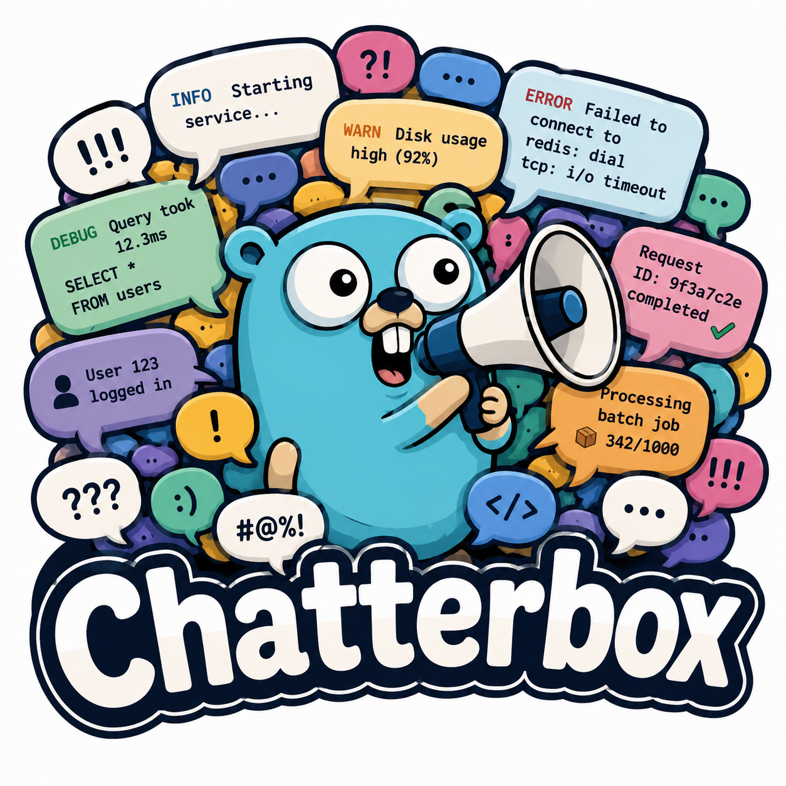

<p align="center">
  
</p>

<h1 align="center">Chatterbox</h1>

<p align="center">
  Synthetic, <strong>fuzzy</strong> log data for testing aggregation pipelines, indexers, and PII rules.
</p>

<p align="center">
  <a href="docs/GUIDE.md">Full guide</a> ·
  <a href="examples/">Examples</a>
</p>

---

## Features

### Core

- **Schema-driven logs** — declare fields in Go; each field uses a pluggable fuzzer
- **Reproducible output** — `WithSeed(uint64)` for deterministic sequences in tests
- **Custom fuzzers** — implement `fuzz.Fuzzer` or use `fuzz.Func` for one-off fields

### Fuzzy data generators

| Fuzzer | What it produces |
|--------|------------------|
| `fuzz.Email` | Realistic emails (typos, subdomains, optional invalid edge cases) |
| `fuzz.TimestampRFC3339` | Timestamps with jitter and fixed base time |
| `fuzz.LevelWeighted` | Weighted log levels (`info`, `warn`, `error`, …) |
| `fuzz.StringFrom` | Random alphanumeric messages |
| `fuzz.UUID` | UUID v4-style strings |
| `fuzz.IPv4` | IPv4 addresses (optional RFC1918 ranges) |
| `fuzz.URL` | HTTP/HTTPS URLs |
| `fuzz.StackTrace` | Multiline stacks (`go`, `java`, `python` styles) |
| `fuzz.Choice` / `fuzz.Weighted` / `fuzz.Optional` | Composable helpers |

### Output formats (`emit`)

| Format | Use case |
|--------|----------|
| `json` (default) | JSON Lines — ELK, Loki, CloudWatch |
| `logfmt` | `key=value` — Loki logfmt, grep-friendly |
| `plain` | Human-readable single lines |
| `syslog` | RFC5424-style syslog |
| `cef` | ArcSight CEF for SIEM |
| `multiline` | Physical multiline events (header + body lines) |
| `slog_json` / `slog_text` | Match `log/slog` handler output |
| `zap_json` | Match Zap production JSON |
| `zerolog_json` | Match Zerolog JSON |

### Emission modes

| Mode | API | Best for |
|------|-----|----------|
| **Batch** | `WriteN`, `NextN`, `GenerateN` | Fixtures, unit tests |
| **Flat rate stream** | `Stream`, `StreamRecords` | Steady load to stdout or a live collector |
| **Phased / burst rates** | `schedule.NewPhases`, `PresetIncidentSpike`, `NewStreamWithSchedule` | Incident spikes, ramp up/down |
| **Record callback** | `StreamRecords`, `GenerateN` + `RecordHandler` | Log through **your** slog, zap, logrus, etc. |
| **Logger adapters** | `adapter/slog`, `adapter/zap`, `adapter/zerolog` | Byte-identical output from real libraries |

### Trace correlation

- **`WithCorrelation`** — N consecutive lines share `trace_id`, `request_id`, and optional `span_id`
- Optional **`TimestampStep`** so lines within a trace sort correctly
- Works with multiline stack traces and any formatter

### Production-realistic testing

- Logger-shaped JSON without importing zap/zerolog in your test binary
- Pass records to your existing logging stack (hooks, sampling, formatters apply)
- Load-test Filebeat multiline rules, trace queries in Loki/Tempo, PII on fuzzy emails

---

## Install

```bash
go get github.com/Haydn202/Chatterbox
```

Requires Go 1.22+ (`math/rand/v2`).

**Deep dive:** [docs/GUIDE.md](docs/GUIDE.md)

---

## Quickstart

```go
package main

import (
	"os"

	"github.com/Haydn202/Chatterbox"
	"github.com/Haydn202/Chatterbox/fuzz"
)

func main() {
	schema := chatterbox.NewSchema(
		chatterbox.MakeField("timestamp", fuzz.TimestampRFC3339(fuzz.WithJitter(30))),
		chatterbox.MakeField("level", fuzz.LevelWeighted(map[string]float64{
			"info": 0.7, "warn": 0.2, "error": 0.1,
		})),
		chatterbox.MakeField("email", fuzz.Email()),
		chatterbox.MakeField("client_ip", fuzz.IPv4()),
		chatterbox.MakeField("message", fuzz.StringFrom(10, 120)),
	)

	gen := chatterbox.NewGenerator(schema, chatterbox.WithSeed(42))
	_ = gen.WriteN(os.Stdout, 1000)
}
```

---

## Examples

| Example | Demonstrates |
|---------|----------------|
| [stream_records_slog](examples/stream_records_slog/main.go) | `StreamRecords` + manual slog mapping |
| [stream_slog](examples/stream_slog/main.go) | `adapter/slog` + phased stream |
| [incident_burst](examples/incident_burst/main.go) | Correlation + incident spike + slog |

```bash
go run ./examples/incident_burst
```

---

## Correlation

Group related log lines the way a real request does:

```go
gen := chatterbox.NewGenerator(schema,
    chatterbox.WithSeed(42),
    chatterbox.WithCorrelation(chatterbox.CorrelationConfig{
        MinLines:      3,
        MaxLines:      8,
        TimestampStep: 2 * time.Millisecond,
        SpanIDField:   "span_id", // optional
    }),
)
```

---

## Bursty / phased traffic

Model normal load, a spike, then recovery:

```go
import "github.com/Haydn202/Chatterbox/schedule"

sched, _ := schedule.PresetIncidentSpike(10, 150, time.Minute, 30*time.Second)
stream, _ := chatterbox.NewStreamWithSchedule(gen, sched)
_ = stream.Run(ctx, os.Stdout)

// Or deliver raw records to your logger:
_ = gen.StreamRecordsWithSchedule(ctx, sched, 0, myHandler)
```

---

## Log through your own logger

```go
_ = gen.StreamRecords(ctx, 25, 0, func(ctx context.Context, rec map[string]any) error {
    slog.Default().Info(fmt.Sprint(rec["message"]),
        "trace_id", rec["trace_id"],
        "email", rec["email"],
    )
    return nil
})
```

Or use an adapter:

```go
h := slog.NewJSONHandler(os.Stdout, nil)
em := slogadapter.New(h, emit.DefaultFieldMap())
_ = adapter.Stream(ctx, gen, 25, 0, em)
```

---

## Multiline stack traces

Physical multiline output for Filebeat-style rules:

```go
gen := chatterbox.NewGenerator(schema,
    chatterbox.WithFormatter(emit.TextMultilineFormatter(emit.TextMultilineConfig{
        HeaderFields: []string{"timestamp", "level", "message"},
        BodyFields:   []string{"stacktrace"},
    })),
)
// schema field: chatterbox.MakeField("stacktrace", fuzz.StackTrace())
```

JSONL mode embeds stacks as a single field with escaped `\n` characters.

---

## Output format selection

```go
opt, _ := chatterbox.WithOutputFormat(emit.FormatZapJSON, emit.Options{})
gen := chatterbox.NewGenerator(schema, opt, chatterbox.WithSeed(42))
```

```go
gen := chatterbox.NewGenerator(schema,
    chatterbox.WithFormatter(emit.Syslog(emit.SyslogConfig{
        Hostname: "api-1",
        AppName:  "checkout",
    })),
)
```

---

## API reference

| Type | Role |
|------|------|
| `Schema` / `MakeField` | Ordered fields and fuzzers |
| `Generator` | `Next`, `WriteN`, `GenerateN`, `StreamRecords`, … |
| `WithSeed` | Reproducible PRNG |
| `WithCorrelation` | Shared trace/request IDs |
| `WithFormatter` / `WithOutputFormat` | Output encoding |
| `Stream` | Rate-limited formatted writes |
| `NewStreamWithSchedule` | Phased formatted writes |
| `RecordHandler` | Per-record callback |
| `schedule.Schedule` | `FlatRate`, `NewPhases`, `PresetIncidentSpike` |
| `fuzz.Fuzzer` | Field value generation |
| `emit.Formatter` | Record → bytes |
| `adapter.Emitter` | Record → slog / zap / zerolog |

---

## Fuzzer options

**Email:** `WithTypoRate(0.05)`, `WithEdgeCases(true)`

**Stack trace:** `WithStackStyle("go"|"java"|"python")`, `WithFrames(min, max)`, `WithPanicMessages([]string)`

**Timestamp:** `WithJitter(seconds)`, `WithBaseTime(time.Time)`

---

## Testing

```bash
go test ./...
```

Golden files: `testdata/golden.jsonl`, `testdata/golden-multiline.txt`

```powershell
$env:UPDATE_GOLDEN="1"; go test ./...
```

---

## Roadmap

- Config-driven schemas (YAML/JSON) with fuzzer registry
- Preset trace bundles (ingress → error + stack templates)
- Poisson / random burst schedules
- ECS / OpenTelemetry JSON presets
- logrus adapter

---

## License

See repository license.
