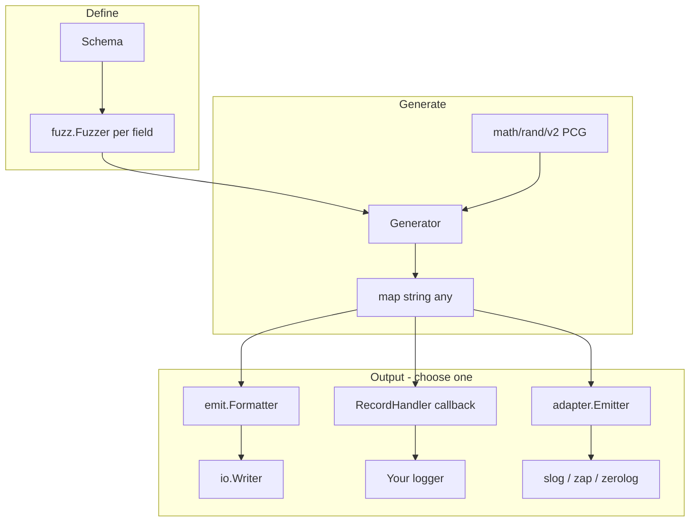

# Chatterbox — detailed guide

Chatterbox is a Go library for generating **synthetic, fuzzy log data** at scale. It is aimed at testing log aggregation pipelines (ELK, Loki, Splunk, Filebeat multiline rules, PII detectors, index templates) and at load-testing live collectors without running a full application.

This document explains how the library is structured, what each component does, and how the pieces fit together.

---

## Table of contents

1. [High-level architecture](#high-level-architecture)
2. [Core concepts](#core-concepts)
3. [Emission paths](#emission-paths)
4. [Package layout](#package-layout)
5. [Schema and fields](#schema-and-fields)
6. [Generator](#generator)
7. [Fuzzers (`fuzz` package)](#fuzzers-fuzz-package)
8. [Formatters (`emit` package)](#formatters-emit-package)
9. [Rate-limited output](#rate-limited-output)
10. [Correlation](#correlation)
11. [Phased rate schedules](#phased-rate-schedules)
12. [Logger integration](#logger-integration)
13. [Reproducibility and testing](#reproducibility-and-testing)
14. [Examples](#examples)
15. [CLI](#cli)
16. [YAML schemas (`config`)](#yaml-schemas-config)
17. [Scenario simulation (`scenario`)](#scenario-simulation-scenario)
18. [Roadmap (not yet implemented)](#roadmap-not-yet-implemented)

---

## High-level architecture

Chatterbox separates **what to generate** (schema + fuzzers) from **how to output** (formatters, callbacks, or logger adapters).



**Typical flows:**

| Goal | Path |
|------|------|
| Dump N JSON lines to a file | `Schema` → `Generator` → default `JSONLFormatter` → `WriteN` |
| Load-test an agent at 50/sec | `Schema` → `Generator` → `Stream.Run(ctx, stdout)` |
| Log through your app’s slog | `Schema` → `Generator` → `StreamRecords` + `RecordHandler` |
| Bytes that look like Zap production JSON | `WithOutputFormat(emit.FormatZapJSON)` → `Stream` |
| Exact `slog.JSONHandler` output | `adapter/slog` → `adapter.Stream` |

---

## Core concepts

### Record

A **record** is one log event: `map[string]any` where keys are field names from your schema and values come from fuzzers (strings, numbers, nil for optional fields, etc.).

Example after `gen.Next()`:

```json
{
  "timestamp": "2026-05-18T12:00:00Z",
  "level": "warn",
  "message": "handler failed",
  "email": "user+tag@corp.net",
  "client_ip": "10.0.1.42"
}
```

### Fuzzer

A **fuzzer** (`fuzz.Fuzzer`) produces one field value per call:

```go
type Fuzzer interface {
    Generate(r *rand.Rand) any
}
```

All randomness flows through the generator’s `*rand.Rand`, so a fixed **seed** yields a fixed sequence of records.

### Schema

A **schema** is an ordered list of fields. Order matters for some formatters (e.g. plain text, logfmt with `FieldOrder`); JSON object key order is not guaranteed when marshaling.

### Formatter

A **formatter** (`emit.Formatter`) turns one record into bytes (usually one line, sometimes multiple physical lines):

```go
type Formatter interface {
    Format(record map[string]any) ([]byte, error)
}
```

### Generator

The **generator** holds the schema, PRNG, and selected formatter. It is the main entry point for creating records and encoded output.

---

## Emission paths

Chatterbox supports three ways to get data out; you can use more than one in the same program for different tests.

### 1. Formatted bytes (default)

```
Generator.NextFormatted() → []byte
Generator.WriteN(w, n)
Stream.Run(ctx, w)        // rate-limited formatted writes
```

Uses `emit.Formatter` (default: JSON Lines). Best for piping to Filebeat, `curl` to Loki, or writing fixture files.

### 2. Record callback (logger-agnostic)

```
Generator.GenerateN(ctx, n, handler)
Generator.StreamRecords(ctx, rate, duration, handler)
```

Each call receives a **copy** of the record map. Your handler logs with slog, zap, logrus, or anything else. No Chatterbox formatter runs on this path.

### 3. Logger adapters (convenience)

```
adapter.GenerateN(ctx, gen, n, emitter)
adapter.Stream(ctx, gen, rate, duration, emitter)
```

Implementations in `adapter/slog`, `adapter/zap`, `adapter/zerolog` map records into native logger APIs. Internally these call `StreamRecords` / `GenerateN`.

---

## Package layout

```
github.com/Haydn202/Chatterbox/
├── schema.go          # Schema, Field, MakeField
├── generator.go       # Generator, Next, WriteN, formatter options
├── records.go         # RecordHandler, GenerateN, StreamRecords
├── stream.go          # Stream (formatted rate-limited writes)
├── format.go          # WithOutputFormat helper
├── fuzz/              # All fuzzers and helpers
├── emit/              # All formatters and Format registry
├── adapter/           # Shared Emitter + Stream helpers
│   ├── slog/          # slog.Handler integration
│   ├── zap/           # zap.Logger integration
│   └── zerolog/       # zerolog.Logger integration
├── examples/          # Runnable examples
└── docs/              # This guide
```

**Dependencies:** Core library uses stdlib only for generation and most formatters. `go.uber.org/zap` and `github.com/rs/zerolog` are required only when importing the zap/zerolog adapters (and are listed in the root `go.mod`).

---

## Schema and fields

```go
schema := chatterbox.NewSchema(
    chatterbox.MakeField("timestamp", fuzz.TimestampRFC3339(fuzz.WithJitter(30))),
    chatterbox.MakeField("level", fuzz.LevelWeighted(map[string]float64{
        "info": 0.7, "warn": 0.2, "error": 0.1,
    })),
    chatterbox.MakeField("message", fuzz.StringFrom(10, 120)),
)
```

| API | Purpose |
|-----|---------|
| `NewSchema(fields ...Field)` | Build schema from ordered fields |
| `MakeField(name, fuzzer)` | Attach a fuzzer to a field name |
| `Schema.Fields()` | Copy of field definitions |

**Conventions** (recommended for presets/adapters, not enforced):

| Field | Typical fuzzer |
|-------|----------------|
| `timestamp` | `fuzz.TimestampRFC3339` |
| `level` | `fuzz.LevelWeighted` or `fuzz.Choice` |
| `message` | `fuzz.StringFrom` |
| `stacktrace` | `fuzz.StackTrace` (with multiline formatter) |

`emit.FieldMap` and adapters default to `timestamp`, `level`, `message` but can be customized.

---

## Generator

### Construction

```go
gen := chatterbox.NewGenerator(schema,
    chatterbox.WithSeed(42),
    chatterbox.WithFormatter(emit.Logfmt(emit.LogfmtConfig{})),
)
```

| Option | Effect |
|--------|--------|
| `WithSeed(uint64)` | Reproducible sequence (`rand/v2` PCG) |
| `WithFormatter(emit.Formatter)` | Output encoding (default `JSONLFormatter`) |
| `WithOutputFormat(format, opts)` | Build formatter from `emit.Format` name |
| `WithCorrelation(cfg)` | Shared `trace_id` / `request_id` for N consecutive lines |

### Methods

| Method | Returns | Uses formatter? |
|--------|---------|-----------------|
| `Next()` | `map[string]any` | No |
| `NextFormatted()` | `[]byte` | Yes |
| `NextJSON()` | `[]byte` (JSON + newline) | Yes (always JSON, ignores custom formatter) |
| `NextN(n)` | `[][]byte` | Yes |
| `WriteN(w, n)` | `error` | Yes |
| `GenerateN(ctx, n, h)` | `error` | No |
| `StreamRecords(ctx, rate, dur, h)` | `error` | No |
| `StreamRecordsWithSchedule(ctx, sched, cap, h)` | `error` | No |

**Note:** `NextJSON()` always marshals with `encoding/json` regardless of `WithFormatter`. Use `NextFormatted()` when a custom formatter is configured.

---

## Fuzzers (`fuzz` package)

### Interface and helpers

| Symbol | Description |
|--------|-------------|
| `Fuzzer` | `Generate(*rand.Rand) any` |
| `Func` | Function adapter type |
| `Choice(values...)` | Uniform random choice |
| `Weighted(map[string]float64)` | Weighted choice; keys sorted for stable RNG consumption |
| `Optional(p, inner)` | `nil` with probability `1-p` |

### Built-in fuzzers

| Fuzzer | Returns | Options |
|--------|---------|---------|
| `Email(opts...)` | Email string | `WithTypoRate(0.05)`, `WithEdgeCases(true)` |
| `TimestampRFC3339(opts...)` | RFC3339 string | `WithJitter(seconds)`, `WithBaseTime(t)` |
| `LevelWeighted(map)` | Level string | Alias for `Weighted` |
| `StringFrom(min, max)` | Alphanumeric string | Inclusive length range |
| `UUID()` | UUID v4-style string | Stdlib-only |
| `IPv4(opts...)` | IPv4 string | `WithPrivateRange(true)` (default) |
| `URL()` | HTTP/HTTPS URL | — |
| `StackTrace(opts...)` | Multiline stack string | `WithStackStyle("go"\|"java"\|"python")`, `WithFrames(min,max)`, `WithPanicMessages([]string)` |

#### Email

Generates mostly valid addresses with varied local parts (`user`, `user.name`, `user+tag`), domains, subdomains, mixed case, and optional typos. `WithEdgeCases` adds invalid-but-plausible forms (`user@@example.com`, etc.) for parser stress tests.

#### Timestamp

Default base time is `time.Now().UTC()` at generation. `WithBaseTime` fixes time for golden tests. `WithJitter` adds ±N seconds.

#### StackTrace

Produces `\n`-separated stack bodies suitable for:

- JSON (escaped newlines in one field), or
- `emit.FormatMultiline` / `TextMultilineFormatter` (physical multiple lines per event)

Styles approximate Go runtime, Java `Exception in thread`, and Python `Traceback` output.

### Custom fuzzers

Implement `Fuzzer` or use `fuzz.Func`:

```go
chatterbox.MakeField("request_id", fuzz.Func(func(r *rand.Rand) any {
    return fmt.Sprintf("req-%d", r.IntN(1_000_000))
}))
```

---

## Formatters (`emit` package)

### Registry

`emit.NewFormatter(format, opts)` and `emit.MustFormatter` support:

| `emit.Format` | Aliases | Description |
|---------------|---------|-------------|
| `json` | `jsonl` | One JSON object per line + newline |
| `logfmt` | — | `key=value` pairs, quoted when needed |
| `plain` | `plaintext`, `text` | `timestamp LEVEL message key=value ...` |
| `syslog` | — | Simplified RFC5424-style line |
| `cef` | — | ArcSight CEF line |
| `multiline` | — | Header line + body fields (requires `Options.Multiline`) |
| `slog_json` | — | `time`, `level`, `msg` + attrs |
| `slog_text` | — | slog text handler style |
| `zap_json` | — | Zap production-like JSON (`ts`, `caller`, `msg`) |
| `zerolog_json` | — | Zerolog-like JSON (`time`, `level`, `message`) |

### Per-format configuration

| Formatter | Config struct | Notable fields |
|-----------|---------------|----------------|
| `Logfmt` | `LogfmtConfig` | `FieldOrder` |
| `PlainText` | `PlainTextConfig` | `Fields`, `Separator` |
| `Syslog` | `SyslogConfig` | `Hostname`, `AppName`, `Facility` |
| `CEF` | `CEFConfig` | `Vendor`, `Product`, `Version` |
| `TextMultiline` | `TextMultilineConfig` | `HeaderFields`, `BodyFields`, `BlankLineBetweenEvents` |
| `SlogJSON` / `SlogText` | `SlogJSONConfig` / `SlogTextConfig` | `FieldMap` |
| `ZapJSON` | `ZapJSONConfig` | `FieldMap`, `Caller` |
| `ZerologJSON` | `ZerologJSONConfig` | `FieldMap` |

### Multiline formatter

Used with `fuzz.StackTrace` to test **physical** multiline ingestion (e.g. Filebeat multiline patterns):

```
2026-05-18T12:00:00Z level=error message="handler failed"
panic: connection reset by peer

goroutine 17 [running]:
...
```

Header fields are written as one `key=value` line; body fields are appended with real newlines preserved.

### FieldMap

`emit.FieldMap` renames schema fields when producing logger-shaped output:

```go
emit.DefaultFieldMap() // timestamp, level, message
```

Used by `slog_json`, `zap_json`, `zerolog_json`, and all adapters.

---

## Rate-limited output

Flat-rate APIs use `schedule.FlatRate` internally. The first event is emitted immediately; each subsequent event waits `1/rate` seconds (minimum 1µs).

### Formatted: `Stream`

```go
stream, err := chatterbox.NewStream(gen, 25.0,
    chatterbox.WithStreamDuration(10*time.Minute),
)
err = stream.Run(ctx, os.Stdout)
```

| Parameter | Behavior |
|-----------|----------|
| `rate` | Events per second (> 0) |
| `WithStreamDuration(0)` | Run until `ctx` cancelled |
| `WithStreamDuration(d)` | Stop after `d` (returns `nil`) |
| `ctx` cancelled | Returns `ctx.Err()` |

### Records: `StreamRecords`

Same timing, but calls `RecordHandler` with raw maps instead of writing formatted bytes.

```go
err := gen.StreamRecords(ctx, 25, 0, func(ctx context.Context, rec map[string]any) error {
    // log rec with your library
    return nil
})
```

---

## Correlation

Group consecutive records into a **trace** with shared IDs (for Loki/Tempo/ELK trace queries and multiline + correlation rules).

```go
gen := chatterbox.NewGenerator(schema,
    chatterbox.WithSeed(42),
    chatterbox.WithCorrelation(chatterbox.CorrelationConfig{
        TraceIDField:   "trace_id",    // default
        RequestIDField: "request_id",  // default
        SpanIDField:    "span_id",     // optional; omit when empty
        MinLines:       2,
        MaxLines:       6,
        TimestampStep:  2 * time.Millisecond, // optional ordering within trace
    }),
)
```

- After each `Next()`, correlation **overwrites** `trace_id`, `request_id`, and optional `span_id` for the current trace.
- When a trace ends, new UUIDs are generated; run length is uniform in `[MinLines, MaxLines]`.
- Other fields (`message`, `level`, `stacktrace`) still come from fuzzers — use `fuzz.Optional` on stack traces so only some lines include stacks.

---

## Phased rate schedules

Package [`schedule`](../schedule/schedule.go) drives bursty / incident-shaped load.

```go
sched, err := schedule.NewPhases(
    schedule.Phase{Rate: 10, Duration: 5 * time.Minute},
    schedule.Phase{Rate: 200, Duration: 30 * time.Second},
    schedule.Phase{Rate: 10, Duration: 0}, // until ctx cancel
)
// or
sched, _ := schedule.PresetIncidentSpike(10, 200, 5*time.Minute, 30*time.Second)

stream, _ := chatterbox.NewStreamWithSchedule(gen, sched)
_ = stream.Run(ctx, os.Stdout)

_ = gen.StreamRecordsWithSchedule(ctx, sched, 0, handler)
```

| API | Role |
|-----|------|
| `schedule.FlatRate(n)` | Same as legacy `rate float64` |
| `schedule.NewPhases(...)` | Sequential rates; only last phase may have `Duration: 0` |
| `NewStreamWithSchedule` | Formatted output with phases |
| `StreamRecordsWithSchedule` | Callback output with phases |
| `WithStreamDuration` | Optional overall wall-clock cap on `Stream` |

See [`examples/incident_burst`](../examples/incident_burst/main.go).

---

## Logger integration

### When to use which approach

| Approach | API | Output identical to production logger? |
|----------|-----|--------------------------------------|
| Callback | `StreamRecords` / `GenerateN` | Yes, if **your** logging code matches prod |
| Format preset | `FormatSlogJSON`, `FormatZapJSON`, … | Approximate JSON shape |
| Adapter | `adapter/slog`, `adapter/zap`, `adapter/zerolog` | Yes for that library’s handler/encoder |

### Callback example (slog)

See [`examples/stream_records_slog/main.go`](../examples/stream_records_slog/main.go).

### slog adapter

```go
h := slog.NewJSONHandler(os.Stdout, &slog.HandlerOptions{Level: slog.LevelDebug})
em := slogadapter.New(h, emit.DefaultFieldMap())
_ = adapter.Stream(ctx, gen, 10, 30*time.Second, em)
```

The adapter builds `slog.Record`, sets level/time/message from `FieldMap`, and passes remaining fields as attributes.

### zap / zerolog adapters

Same pattern: `zapadapter.New(logger, fm)` / `zerologadapter.New(logger, fm)` then `adapter.Stream` or `adapter.GenerateN`.

---

## Reproducibility and testing

### Seeds

```go
chatterbox.WithSeed(42)
```

Same schema + seed → same sequence of field values. Weighted fuzzers sort keys before building the distribution so map iteration order does not affect RNG consumption.

### Golden files

| File | Test |
|------|------|
| `testdata/golden.jsonl` | JSONL formatter, seed 42, 5 events |
| `testdata/golden-multiline.txt` | Multiline + stack trace |

Regenerate:

```powershell
$env:UPDATE_GOLDEN="1"; go test ./...
```

### Running tests

```bash
go test ./...
```

---

## Examples

| Example | Demonstrates |
|---------|----------------|
| [`examples/stream_records_slog`](../examples/stream_records_slog/main.go) | `StreamRecords` + manual slog mapping |
| [`examples/stream_slog`](../examples/stream_slog/main.go) | `adapter/slog` + `adapter.Stream` |
| [`examples/incident_burst`](../examples/incident_burst/main.go) | Correlation + phased spike + slog |

Run from module root:

```bash
go run ./examples/stream_slog
go run ./examples/stream_records_slog
```

---

## CLI

Install:

```bash
go install github.com/Haydn202/Chatterbox/cmd/chatterbox@latest
```

The CLI wraps the same generator, formatters, correlation, and schedules as the library. Schemas come from [`preset`](../preset/preset.go) or YAML via [`config`](../config/load.go).

### Commands

- `chatterbox run [flags]` — generate logs (preset or `--schema`)
- `chatterbox scenario run -f FILE` — multi-service failure simulation
- `chatterbox version` — print build version

### Presets

| Preset | Description |
|--------|-------------|
| `default` | General-purpose JSON logs with email and client_ip |
| `api` | Adds `url` field |
| `minimal` | timestamp, level, message only |
| `multiline-error` | Error-heavy levels, stacktrace enabled, correlation on by default |

Override fields: `--email`, `--no-email`, `--stacktrace`, `--correlate`, `--no-correlate`.

### Modes

- **Batch:** `-n 1000` writes exactly N lines and exits.
- **Stream:** omit `-n`; use `-r` (default 10/sec). `-d 5m` caps duration; omit `-d` to run until SIGINT.
- **Burst:** `--burst` uses `PresetIncidentSpike` with `--rate`, `--burst-rate`, `--burst-base-duration`, `--burst-peak-duration`.

### Library vs CLI

Use the **library** when you need custom schemas, logger adapters, or `RecordHandler` integration. Use the **CLI** for quick pipe-to-agent tests and ops scripts.

---

## YAML schemas (`config`)

Load a declarative schema from YAML:

```yaml
fields:
  - name: timestamp
    type: timestamp_rfc3339
    jitter_seconds: 30
  - name: level
    type: level_weighted
    weights: { info: 0.7, warn: 0.2, error: 0.1 }
  - name: message
    type: string
    min_len: 10
    max_len: 120
```

```go
schema, err := config.LoadSchemaFile("schemas/api-service.yaml")
gen := chatterbox.NewGenerator(schema, chatterbox.WithSeed(1))
```

**Fuzzer types:** `timestamp_rfc3339`, `level_weighted`, `weighted`, `string`, `email`, `uuid`, `ipv4`, `url`, `choice`, `constant`, `optional`, `stacktrace`.

CLI: `chatterbox run --schema schemas/api-service.yaml -n 1000`

Example file: [`schemas/api-service.yaml`](../schemas/api-service.yaml)

---

## Scenario simulation (`scenario`)

Scenarios model **multi-service cascading failures** with a timeline of named events. Each service uses a preset or schema file; every log line includes a `service` field.

```yaml
scenario:
  name: cascading-failure
  seed: 42
  rate: 25
  duration: 15m

services:
  api: { preset: api, rate_weight: 0.4 }
  auth: { preset: default }
  redis: { preset: minimal }
  postgres: { preset: default }

timeline:
  - event: baseline
    duration: 2m
  - event: redis_latency_spike
    duration: 3m
    services: [redis, api]
  - event: retry_storm
    services: [api, auth]
```

**Shorthand:** omit `timeline` and list `events:` only; phases use `default_phase_duration` and an implicit `baseline` first.

**Correlation:** `correlate: true` (default) adds `trace_id` and `request_id` to every line. IDs are **shared across services** so a trace can span `api` → `redis` → `postgres` in one synthetic request. Disable with `correlate: false` or `chatterbox scenario run --no-correlate`.

**Built-in events:** `baseline`, `redis_latency_spike`, `retry_storm`, `pod_restarts`, `db_connection_exhaustion`. Events patch level weights, messages, and rate multipliers.

```go
plan, _ := scenario.ParseFile("scenarios/cascading-failure.yaml")
runner, _ := scenario.NewRunner(plan, scenario.RunnerOptions{})
_ = runner.Run(ctx, scenario.WritersConfig{
    Mode:     scenario.OutputInterleaved,
    Combined: os.Stdout,
})
```

**Output modes:** `interleaved` (single stream with `service` field), `split` (one file per service under `--output-dir`), `both`.

CLI:

```bash
chatterbox scenario run -f scenarios/cascading-failure.yaml
chatterbox scenario run -f scenarios/cascading-failure.yaml --output-mode both -o out/combined.jsonl --output-dir out/
```

---

## Roadmap (not yet implemented)

- Preset trace bundles (ingress → error+stack templates)
- Poisson / random burst schedules
- Inline user-defined event YAML (patches in Go registry today)
- CLI HTTP sink to remote ingest endpoints
- **logrus** adapter
- Additional emitters (ECS-shaped JSON, full syslog variants)
- Optional `chatterbox/record` helpers (`ParseLevel`, `AttrsExcept`) for less boilerplate in callbacks

---

## Quick reference card

```go
// 1. Define schema
schema := chatterbox.NewSchema(
    chatterbox.MakeField("timestamp", fuzz.TimestampRFC3339()),
    chatterbox.MakeField("level", fuzz.LevelWeighted(map[string]float64{"info": 1})),
    chatterbox.MakeField("message", fuzz.StringFrom(5, 50)),
)

// 2. Create generator
gen := chatterbox.NewGenerator(schema, chatterbox.WithSeed(1))

// 3a. Batch JSONL to writer
_ = gen.WriteN(os.Stdout, 1000)

// 3b. Rate-limited JSONL
s, _ := chatterbox.NewStream(gen, 50)
_ = s.Run(ctx, os.Stdout)

// 3c. Your logger
_ = gen.StreamRecords(ctx, 50, 0, myHandler)

// 3d. Zap-shaped lines without zap import
opt, _ := chatterbox.WithOutputFormat(emit.FormatZapJSON, emit.Options{})
gen = chatterbox.NewGenerator(schema, opt, chatterbox.WithSeed(1))
_ = gen.WriteN(os.Stdout, 1000)
```

For install and a short quickstart, see the [README](../README.md).
